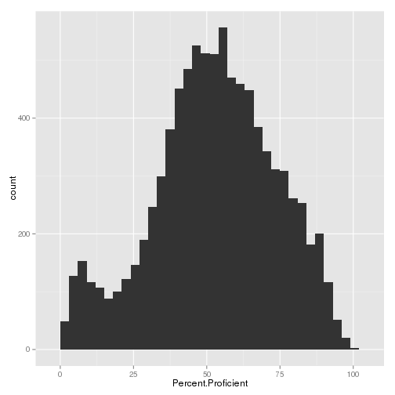

# Every Child is Unique

When choosing a school for your child, there are many important
factors to consider

- Ability of your child.
- Your child's areas of interest.
- Your particular school district.

With my tool, users are able to view relevant test results for their particular district, for the grade level of interest, with their subject of interest.

--- &twocol w1:70% w2:30%

# Distribution of California Schools

*** =right

 

*** =left
Here we can see the distribution of test scores through California schools. With this much variation, it is important to be informed when selecting a school for your child.

With the my application it is easy to detemine which are the high performing schools, and which are the low perfomers in your district.

---

# Dataset

Data is taken from the California Department of Education's website [1]. In it, there are data for 1628 different districts, containing 8634 schools. For these districts, 16647348 test scores were recorded. For each of these, the level of proficiency is reported as: 
- Far Below Basic
- Below Basic
- Basic
- Proficient
- Advanced

With my application you are able to see the fraction of "Proficient" and "Advanced" scores achieved for each school in a given district, and you'll be able to see see it broken down by grade level and by subject.

[1] - <a href="http://star.cde.ca.gov/star2013/index.aspx">California STAR Program</a>

--- &twocol

# Tests Reported

You are able to see results broken down by grade levels, and for the following tests:

*** =left
<ul>
<li style="font-size: 12pt;">  CST English-Language Arts </li><li style="font-size: 12pt;">  CST Mathematics </li><li style="font-size: 12pt;">  CST Algebra I </li><li style="font-size: 12pt;">  CST Integrated Math 1 </li><li style="font-size: 12pt;">  CST Geometry </li><li style="font-size: 12pt;">  CST Integrated Math 2 </li><li style="font-size: 12pt;">  CST Algebra II </li><li style="font-size: 12pt;">  CST Integrated Math 3 </li><li style="font-size: 12pt;">  CST Summative High School Mathematics (Grade 9-11)  </li><li style="font-size: 12pt;">  CST World History </li><li style="font-size: 12pt;">  CST U.S. History </li><li style="font-size: 12pt;">  CST Biology/Life Sciences </li><li style="font-size: 12pt;">  CST Chemistry </li><li style="font-size: 12pt;">  CST Earth Science </li><li style="font-size: 12pt;">  CST Physics </li><li style="font-size: 12pt;">  CST Integrated/Coordinated Science 1 </li>.
</ul>
*** =right
<ul>
<li style="font-size: 12pt;">  CST Integrated/Coordinated Science 2 </li><li style="font-size: 12pt;">  CST Integrated/Coordinated Science 3 </li><li style="font-size: 12pt;">  CST Integrated/Coordinated Science 4 </li><li style="font-size: 12pt;">  CST General Mathematics (Grades 6 & 7 Standards) </li><li style="font-size: 12pt;">  CST History - Social Science Grade 8 Cumulative </li><li style="font-size: 12pt;">  CAPA English-Language Arts </li><li style="font-size: 12pt;">  CAPA Mathematics </li><li style="font-size: 12pt;">  CST Science - Grade 5, Grade 8, and Grade 10 Life Science </li><li style="font-size: 12pt;">  STS Reading-Language Arts </li><li style="font-size: 12pt;">  STS Mathematics </li><li style="font-size: 12pt;">  CAPA Science </li><li style="font-size: 12pt;">  CMA English-Language Arts </li><li style="font-size: 12pt;">  CMA Mathematics </li><li style="font-size: 12pt;">  CMA Science - Grade 5, Grade 8, and Grade 10 Life Science </li><li style="font-size: 12pt;">  STS Algebra I </li><li style="font-size: 12pt;">  STS Geometry </li>.
</ul>
